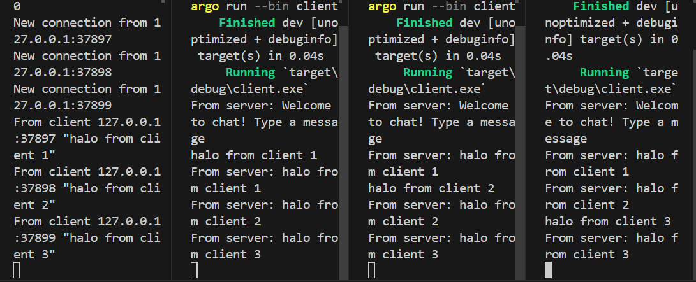

### Eksperiment 2.1

- Untuk menjalan server saya menggunakan perintah `cargo run --bin server`. Untuk menjalankan client saya menggunakan perintah `cargo run --bin client`. Setelah kedua perintah ini dijalankan, setiap suatu client mengirimkan pesan, server akan menerima pesan tersebut lalu mengirimkannya kepada client yang lain.

### Eksperiment 2.2
- Ketika kita hanya mengganti port pada client dan tidak mengganti port pada server maka akan terjadi error saat berusaha untuk menjalankan program client karena tidak ada koneksi yang bisa dibuat 

- Ketika kita mengganti kedua port (pada client dan server) maka aplikasi akan berjalan dengan lancar sama seperti sebelumnya

